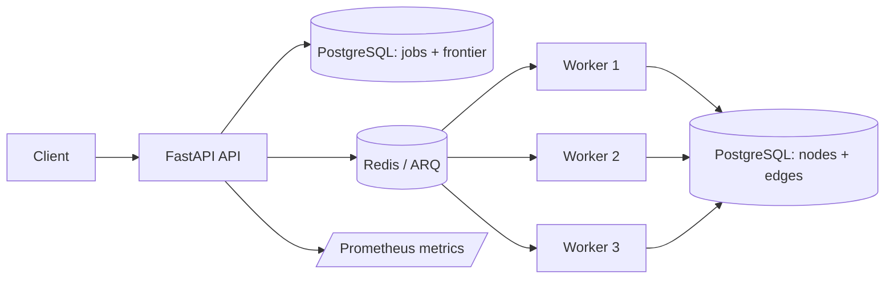

# Social Graph Crawler

A distributed crawling and data-ingestion portfolio project built with FastAPI, PostgreSQL, Redis, and ARQ. It persists crawl jobs and frontier state in PostgreSQL, distributes committed work to independently scalable workers, and demonstrates retries, duplicate protection, failure tracking, and Prometheus metrics.

## Architecture



## How a crawl works

1. FastAPI stores a job and deduplicated frontier rows in PostgreSQL.
2. It enqueues committed frontier items in Redis/ARQ.
3. Workers claim leased items, throttle by source, and persist success, retry, or permanent failure state.
4. PostgreSQL finalizes the parent job when no non-terminal frontier rows remain.

Processing is **at least once**. Exactly-once delivery is not claimed; database constraints and idempotent persistence make repeated work safe.

## Verified behavior

The deterministic fixture proves:

| Scenario | Result |
|---|---|
| Success | Completes on attempt 1 |
| Transient failure | Fails twice, completes on attempt 3 |
| Permanent failure | Persists as failed and appears in the failures API |
| Duplicate discovery | PostgreSQL rejects duplicate frontier work per job |
| Worker pool | Three independent ARQ workers process work |

GitHub Codespaces verification has exercised Docker Compose, PostgreSQL, Redis, FastAPI, three workers, migrations, queue delivery, frontier processing, persistence, metrics, and 11 containerized backend tests.

## Run in GitHub Codespaces

```bash
./scripts/verify_codespaces.sh
```

The successful verifier ends with:

```text
V2 VERIFY SUCCEEDED:
API PostgreSQL Redis workers migrations crawl-frontier fixture-retry duplicate-protection persistence metrics tests
```

FastAPI is available on port 8000 (`/docs` and `/metrics/`). Stop the stack with:

```bash
docker compose down
```

## Scope and limitations

This repository demonstrates a small, durable crawling pipeline—not a web-scale crawler. Live GitHub, Reddit, and Wikipedia sources, frontend integration, cloud deployment, and large external workloads are not yet verified.

The React/D3 frontend remains in the source tree but is intentionally excluded from the V2 demo because it does not yet present the frontier workflow.

## Further reading

- [V2 implementation plan](docs/V2_IMPLEMENTATION_PLAN.md)
- [Verification report](docs/VERIFICATION_REPORT.md)
- [Demo script](docs/DEMO_SCRIPT.md)
- [Interview notes](docs/INTERVIEW_NOTES.md)
- [Portfolio copy](docs/PORTFOLIO_COPY.md)
