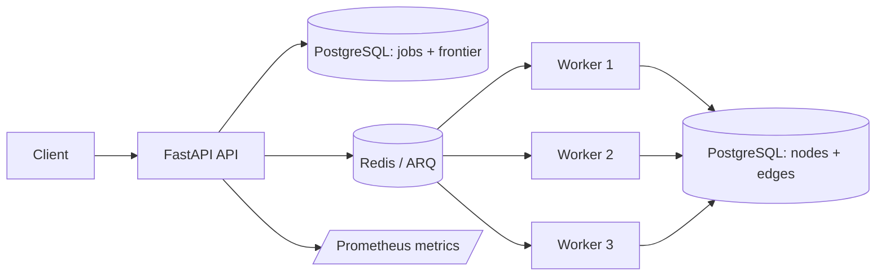

# Social Graph Crawler

A local-first graph-crawling application built with FastAPI, PostgreSQL, Redis, ARQ, React, and D3. It crawls public Mastodon, GitHub, and Wikipedia data into a persistent graph and visualizes the resulting nodes and relationships.

## Architecture



## How a crawl works

1. FastAPI stores a job and deduplicated frontier rows in PostgreSQL.
2. It enqueues committed frontier items in Redis/ARQ.
3. Workers claim leased items, throttle by source, and persist success, retry, or permanent failure state.
4. PostgreSQL finalizes the parent job when no non-terminal frontier rows remain.

Processing is **at least once**. Exactly-once delivery is not claimed; database constraints and idempotent persistence make repeated work safe.

## Verified behavior

The deterministic fixture proves:

| Scenario | Result |
|---|---|
| Success | Completes on attempt 1 |
| Transient failure | Fails twice, completes on attempt 3 |
| Permanent failure | Persists as failed and appears in the failures API |
| Duplicate discovery | PostgreSQL rejects duplicate frontier work per job |
| Worker pool | Three independent ARQ workers process work |

GitHub Codespaces verification has exercised Docker Compose, PostgreSQL, Redis, FastAPI, three workers, migrations, queue delivery, frontier processing, persistence, metrics, and 11 containerized backend tests.

## Run locally

Install Docker Desktop (with Docker Compose v2). Copy the example environment file before adding optional credentials:

```powershell
Copy-Item .env.example .env
docker compose up --build --detach --wait --scale worker=3
```

The API is at http://localhost:8000/docs and the UI is at http://localhost:3000. Stop backend services with:

```powershell
docker compose down
```

For frontend-only development outside Docker, use Node.js 20+, then run `npm install` and `npm start` from `frontend`.

## Sources and credentials

- **Wikipedia** works without credentials; enter an article title such as `Python (programming language)`.
- **GitHub** works with public data. Set `GITHUB_TOKEN` in `.env` to avoid the low anonymous rate limit.
- **Mastodon** works with public data. Enter a full handle such as `Gargron@mastodon.social`; the crawler stores the account and its visible following graph. `MASTODON_ACCESS_TOKEN` is optional for instances that restrict public relationship endpoints.
- **Fixture** is an offline test source. `v2-demo` exercises successful work, retry behavior, a permanent failure, and duplicate protection.

Each submitted job carries its source, depth, and entity limit into a durable PostgreSQL frontier record. Workers select the crawler matching that source, persist graph nodes/edges, and finalize the job once its frontier is terminal.

## Verification

Backend checks can run without Docker:

```powershell
& .\.venv\Scripts\python.exe -m pytest backend\tests -q
```

`scripts/verify_codespaces.sh` remains available for a Linux/WSL Docker verification run.

## Scope and limitations

This is a small, local application—not a web-scale crawler. Respect source terms of service and rate limits. Crawls intentionally cap depth and entity count, and the UI loads a bounded graph view for responsiveness. Cloud deployment, user accounts, scheduling, and large external workloads are outside this repository's scope.

## Further reading

- [V2 implementation plan](docs/V2_IMPLEMENTATION_PLAN.md)
- [Verification report](docs/VERIFICATION_REPORT.md)
- [Demo script](docs/DEMO_SCRIPT.md)
- [Interview notes](docs/INTERVIEW_NOTES.md)
- [Portfolio copy](docs/PORTFOLIO_COPY.md)
