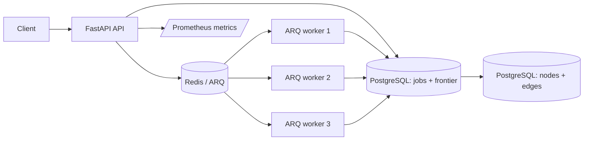

# Social Graph Crawler

A distributed crawling and data-ingestion portfolio project built with FastAPI, PostgreSQL, Redis, and ARQ. Crawl work is persisted in a PostgreSQL frontier, distributed to independently scalable workers, and exposed through a small API with retries, failure tracking, duplicate protection, and Prometheus metrics.

## Why this project exists

Crawling is more than making HTTP requests: work must survive process failures, avoid duplicate processing, retry only when useful, coordinate workers, and retain enough state to explain what happened. This project implements that smaller, demonstrable slice with deterministic fixtures rather than claiming web-scale crawling.

## Architecture



## How a crawl works

1. FastAPI persists a crawl job and its frontier rows in PostgreSQL.
2. PostgreSQL prevents duplicate targets within that job.
3. After commit, the API enqueues each frontier item in Redis/ARQ.
4. A worker claims its specific frontier item using a PostgreSQL lease.
5. The worker throttles by source, processes the item, and persists its outcome.
6. Transient errors are delayed and retried; permanent errors remain visible.
7. Once no queued or processing frontier rows remain, PostgreSQL finalizes the parent job.

Delivery is **at least once**. Exactly-once is not claimed: a worker can fail after persistence but before acknowledgement. Database uniqueness constraints and idempotent node/edge persistence make repeated work safe.

## Reliability features

- Durable PostgreSQL frontier with statuses, attempts, leases, timestamps, and errors
- Redis-backed ARQ workers; scale with `docker compose up --scale worker=3`
- Exponential retry for retriable deterministic failures
- PostgreSQL duplicate frontier constraint and idempotent graph persistence
- Lease-based stale-work recovery through the resume API
- Redis-coordinated per-source request spacing
- Parent finalization based on persisted terminal frontier state
- `/health`, `/ready`, and `/metrics/`
- Persistent Docker volumes and a reproducible Codespaces verifier

## Verified failure scenarios

| Scenario | Verified result |
|---|---|
| Success | Completes on attempt 1 |
| Transient failure | Fails twice, completes on attempt 3 |
| Permanent failure | Persists as failed and appears in `/failures` |
| Duplicate discovery | Duplicate frontier insertion is rejected per job |
| Worker pool | Three independent ARQ worker containers consume work |

## Run in GitHub Codespaces

Create a Codespace from GitHub, wait for setup, then run:

```bash
./scripts/verify_codespaces.sh
```

This is the complete verified path: it starts PostgreSQL, Redis, FastAPI, and three workers; migrates PostgreSQL; runs the deterministic V2 fixture; verifies retry, failure, deduplication, persistence, metrics, and containerized tests. A successful run ends with `V2 VERIFY SUCCEEDED`.

FastAPI is forwarded on port 8000. Open its forwarded URL with `/docs` for Swagger or `/metrics/` for Prometheus output. Stop the stack with `docker compose down`.

## Docker Compose

```bash
docker compose up --build --scale worker=3
docker compose down
```

The backend applies `alembic upgrade head` at startup. To apply it explicitly:

```bash
docker compose exec backend alembic upgrade head
```

## API examples

```bash
curl -X POST http://localhost:8000/api/v1/crawl/start \
  -H 'Content-Type: application/json' \
  -d '{"source":"fixture","start_entity":"v2-demo-demo","depth":2,"max_entities":10}'
```

Use the returned ID with:

```text
GET /api/v1/crawl/jobs/{id}
GET /api/v1/crawl/jobs/{id}/frontier
GET /api/v1/crawl/jobs/{id}/failures
GET /metrics/
```

## Key design decisions

**PostgreSQL frontier, not Redis-only state.** Redis delivers tasks; PostgreSQL is the durable record of work, attempts, leases, and final state.

**ARQ, not Celery.** ARQ is a smaller async-native fit for the existing FastAPI and aiohttp code. It provides Redis-backed task delivery without adding a second concurrency model.

**Database constraints for deduplication.** The database is stronger than process-local sets when workers run concurrently or work is redelivered.

**At-least-once processing.** This is the practical delivery model. Idempotent persistence is more credible than claiming exactly-once distributed execution.

**Deterministic fixtures.** Success, retries, permanent failures, and duplicates are verified without credentials or unstable third-party APIs.

## Verified environment

### Verified

GitHub Codespaces, Docker Compose, PostgreSQL, Redis, FastAPI, three ARQ workers, Alembic migrations, frontier persistence, ARQ delivery, retry behavior, duplicate protection, permanent failures, parent finalization, PostgreSQL persistence, Prometheus metrics, and 11 containerized backend tests.

### Not yet verified

Live GitHub, Reddit, and Wikipedia crawling; cloud deployment; large external workloads; multi-region operation; frontend build/integration; and web-scale performance.

## Frontend status

The React/D3 frontend remains in the repository but is not part of the supported V2 demo: it has not been verified against the frontier APIs and does not render persisted edges. V2 deliberately focuses on the backend ingestion system.

## Further reading

- [V2 implementation plan](docs/V2_IMPLEMENTATION_PLAN.md)
- [Verification report](docs/VERIFICATION_REPORT.md)
- [Demo script](docs/DEMO_SCRIPT.md)
- [Interview notes](docs/INTERVIEW_NOTES.md)
- [Portfolio copy](docs/PORTFOLIO_COPY.md)
